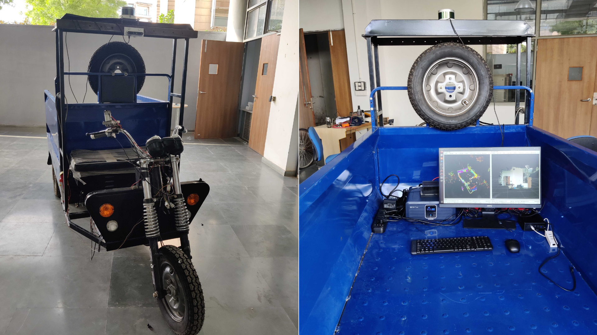

# Autonomous e-Cart

This repository contains the e_rick ROS package for the electric rickshaw built in-house at IIIT Delhi as a part of the autonomous driving project - [ALiVe](https://sites.google.com/iiitd.ac.in/iiitd-alive/home)

## Demonstrations
1. [Static Obstacle Avoidance Demo](https://drive.google.com/file/d/17ly8vjDxwKD6AAUSbPGurJAICTVWojyS/view?usp=sharing)
2. [Keyboard Teleop Operation Demo](https://drive.google.com/file/d/1okGMuzUyRnWGpcceMH9ix6SWWPQ29vHw/view?usp=sharing)
3. [Brake Demo](https://drive.google.com/file/d/1x5sxo3HWZK250eq7wjvr5276ZveoLLC3/view?usp=sharing)




## Structure
This package contains the Arduino-based ROS node which gets the vehicle (in this case, a modified electric-cart) status and publishes it to the Planning stack. Thereafter, subscribes to the Control information for the vechicle to run autonomously.
This package can NOT be run as a stand-alone ROS node; it needs other information along with sensory feedback from the vehicle.

## Joystick Control: 

After connecting to arduino, run

```
roslaunch e-rick erick_joystick_control.launch
```

## How to Run ROS arduino code

1. Upload arduino_erick to arduino

2. Then run:
```
roslaunch e_rick erick_data_collection.launch
```
It publishes the /feedback topic which includes this msg.
```
header: 
  seq: 187
  stamp: 
    secs: 1657564187
    nsecs: 109421035
  frame_id: ''
serial_received: 
  data: ''
steer_encoder: 51
speed_voltage: 279
steer_pwm_engage: 400
steer_pwm_disengage: 400
steer_duration: 150
front_b_pwm_engage: 650
front_b_pwm_disengage: 650
front_b_duration: 150
rear_b_pwm_engage: 200
rear_b_pwm_disengage: 70
rear_b_duration: 150
```

- In case the arduino msg needs to be edited:
```
cd alive-dev
bash src/e_rick/generate_arduino_msg_header.sh
```